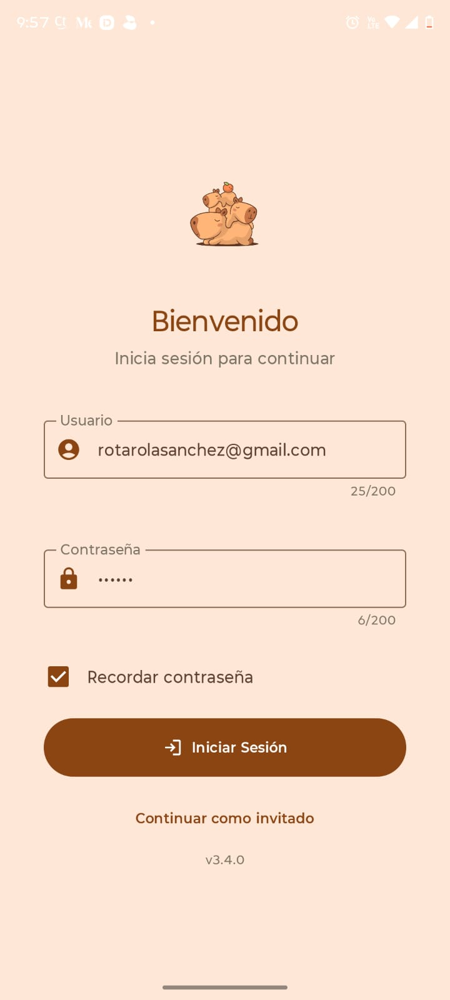
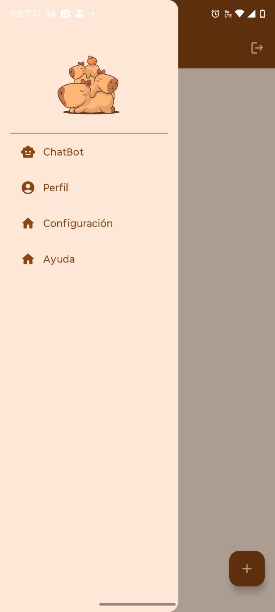

<div align="center">

# 🦫 CapibaraFamily Portfolio

### Kotlin Multiplatform · Compose Multiplatform · Clean Architecture

[](https://github.com/Vistony/Portfolio/actions/workflows/ci.yml)
[](https://kotlinlang.org)
[](https://www.jetbrains.com/lp/compose-multiplatform/)
[](https://developer.android.com)
[](LICENSE)

A **Kotlin Multiplatform** portfolio application targeting **Android**, **iOS**, **Desktop** and **Web (WasmJS)**, built with modern architecture patterns and a full CI/CD pipeline.

</div>

---

## 📸 Screenshots

> _Android · iOS · Web_

| Login | Menu | ChatBot |
|-------|------|---------|
|  |  |  |

---

## 🏗️ Architecture

The project follows **Clean Architecture** with three well-defined layers, implemented as a **KMP shared module** consumed by each platform target.

```
┌─────────────────────────────────────────────────────┐
│                  Presentation Layer                  │
│   Pages · Templates · Organisms · Molecules · Atoms  │
│          ViewModels (MVVM) · StateFlow               │
├─────────────────────────────────────────────────────┤
│                    Domain Layer                      │
│        Use Cases · Repository Interfaces             │
│               Domain Models                         │
├─────────────────────────────────────────────────────┤
│                     Data Layer                       │
│   Repository Implementations · Data Sources          │
│        Mappers · Firebase · ML Kit · Gemini          │
└─────────────────────────────────────────────────────┘
```

### UI — Atomic Design

The entire UI is structured following [Atomic Design](https://bradfrost.com/blog/post/atomic-web-design/):

```
presentation/view/
 ├── atoms/        # Smallest reusable components (Button, TextField, Icon…)
 ├── molecules/    # Combinations of atoms (FormField, SnackBar…)
 ├── organisms/    # Complex sections (ChatBotOrganism, LoginForm…)
 ├── templates/    # Page-level layouts without data
 └── pages/        # Full screens wired to ViewModels
       ├── LoginPage.kt
       ├── MenuPage.kt
       ├── ChatBotPage.kt
       └── AppPage.kt
```

---

## 🎯 Features

| Feature | Description |
|---------|-------------|
| 🔐 **Authentication** | Email/password and Google Sign-In via Firebase Auth |
| 🤖 **AI Chatbot** | Conversational assistant powered by **Gemini API** through Firebase Cloud Functions |
| 📷 **OCR Scanner** | Camera capture + text recognition using **Google ML Kit** |
| 💾 **Credentials Storage** | Optional "Remember me" with platform-native secure storage |
| 🌐 **Multiplatform** | Single shared codebase for Android, iOS, Desktop and Web |
| 📊 **Code Quality** | SonarCloud analysis + JaCoCo coverage reports on every push |
| 🚀 **Automated Delivery** | APK distributed to QA team via Firebase App Distribution after every CI run |

---

## 🧰 Tech Stack

### Core
| Library | Purpose |
|---------|---------|
| [Kotlin 2.1.0](https://kotlinlang.org) | Primary language |
| [Kotlin Multiplatform](https://kotlinlang.org/docs/multiplatform.html) | Shared business logic across platforms |
| [Compose Multiplatform 1.7.1](https://www.jetbrains.com/lp/compose-multiplatform/) | Shared declarative UI |
| [Material Design 3](https://m3.material.io/) | Design system |

### Architecture & DI
| Library | Purpose |
|---------|---------|
| [Koin 4.0](https://insert-koin.io/) | Dependency injection (KMP-compatible) |
| [AndroidX Navigation Compose](https://developer.android.com/jetpack/compose/navigation) | Multiplatform navigation |
| [ViewModel + StateFlow](https://developer.android.com/topic/libraries/architecture/viewmodel) | MVVM state management |

### Firebase (Android)
| Service | Purpose |
|---------|---------|
| Firebase Auth | User authentication |
| Firebase Firestore | Cloud database |
| Firebase Crashlytics | Crash reporting |
| Firebase Cloud Functions | Gemini API proxy |
| Firebase App Distribution | QA delivery pipeline |

### AI & Camera
| Library | Purpose |
|---------|---------|
| [Google ML Kit](https://developers.google.com/ml-kit/vision/text-recognition) | On-device OCR |
| [Gemini API](https://ai.google.dev/) | Generative AI chatbot |
| [CameraX](https://developer.android.com/training/camerax) | Camera capture |

### Networking & Utils
| Library | Purpose |
|---------|---------|
| [OkHttp 4.12](https://square.github.io/okhttp/) | HTTP client (Android) |
| [kotlinx-coroutines](https://github.com/Kotlin/kotlinx.coroutines) | Async & concurrency |
| [kotlinx-datetime](https://github.com/Kotlin/kotlinx-datetime) | Multiplatform date/time |
| [Lottie Compose](https://airbnb.io/lottie/) | Animations |

---

## 📁 Project Structure

```
portafolio_kotlin/
 ├── app/                        # Android application module
 │    ├── src/main/              # Android-specific entry point & manifest
 │    └── build.gradle.kts
 │
 ├── shared/                     # KMP shared module
 │    └── src/
 │         ├── commonMain/       # Business logic, UI, ViewModels
 │         │    └── kotlin/
 │         │         ├── core/           # Storage, services, utilities
 │         │         ├── data/           # Repositories, data sources, mappers
 │         │         ├── domain/         # Use cases, repository interfaces, models
 │         │         └── presentation/   # ViewModels, UI state, Compose (Atomic Design)
 │         ├── androidMain/      # Android platform implementations
 │         ├── iosMain/          # iOS platform implementations
 │         ├── desktopMain/      # Desktop platform implementations
 │         ├── wasmJsMain/       # Web (WasmJS) platform implementations
 │         └── commonTest/       # Shared unit tests (KMP-compatible)
 │
 ├── iosApp/                     # iOS Xcode project
 ├── functions/                  # Firebase Cloud Functions (Gemini proxy)
 └── .github/workflows/
      ├── ci.yml             # Quality gate → Firebase QA distribution
      ├── cd.yml             # Signed AAB → Play Store production
      └── ios-build.yml      # KMP iOS framework + Xcode build
```

---

## 🔄 CI/CD Pipeline

The project has **three independent pipelines** managed via GitHub Actions.

---

### 1. CI — Quality Gate & QA Delivery (`ci.yml`)

Triggered on **push / PR to `release/*`** branches. The full chain only runs when the commit message contains `Send QA`.

```
lint ──► unit-test ──► instrumentation-test ──► sonar ──► Firebase Distribution
  ↑
  Only when commit message includes "Send QA"
```

| Job | Runner | Key steps |
|-----|--------|-----------|
| `lint` | ubuntu-latest | `./gradlew lint` · uploads HTML report |
| `unit-test` | ubuntu-latest | `./gradlew test --parallel --build-cache` · uploads JUnit report |
| `instrumentation-test` | ubuntu-latest + KVM | Android emulator API 29 (Nexus 6) · Espresso (`connectedCheck`) |
| `sonar` | ubuntu-latest | JaCoCo coverage · self-hosted **SonarQube** scan · Quality Gate check · APK artifact |
| `Firebase` | ubuntu-latest | Downloads APK artifact · distributes to **QA group** via Firebase App Distribution |

> All jobs inject `google-services.json` from a base64 secret and clean it up in a final `always()` step.

---

### 2. CD — Release to Play Store (`cd.yml`)

Triggered on **push to `main`** (or manually via `workflow_dispatch`).

```
Checkout
  └─► Inject secrets (keystore · google-services.json · API keys · Firebase web config)
        └─► ./gradlew :app:bundleRelease
              └─► Upload AAB artifact
                    └─► Publish to Play Store (production track, status: completed)
```

| Step | Detail |
|------|--------|
| Signing | Keystore and `keystore.properties` decoded from base64 secrets |
| API keys | `GEMINI_API_KEY`, `MODEL_NAME`, `FIREBASE_WEB_API_KEY` injected into `local.properties` |
| Web target | `firebase-config.js` generated for the **WasmJS** build |
| Distribution | `r0adkll/upload-google-play@v1.1.3` → `production` track, `inAppUpdatePriority: 2` |

---

### 3. iOS Build & Test (`ios-build.yml`)

Triggered on **push to `main` / `develop`** and PRs to `main`.

```
Checkout (macOS-14 / Apple M1)
  └─► KMP framework: iosSimulatorArm64 + iosArm64
        └─► Xcode build (iphonesimulator · iPhone 15 Pro · Debug)
              └─► Upload framework artifact (7-day retention)
```

| Step | Detail |
|------|--------|
| Runner | `macos-14` (Apple Silicon — free tier) |
| Gradle cache | `~/.gradle/caches`, `~/.gradle/wrapper`, `~/.konan` |
| KMP targets | `linkDebugFrameworkIosSimulatorArm64` + `linkDebugFrameworkIosArm64` |
| Xcode build | `xcpretty` output, continues on error (`|| true`) |

---

## ⚙️ Local Setup

### Prerequisites

- Android Studio Meerkat or later
- JDK 17
- Android SDK (min API 24)

### 1. Clone the repository

```bash
git clone https://github.com/Vistony/Portfolio.git
cd Portfolio
```

### 2. Configure `google-services.json`

Place your Firebase `google-services.json` inside `app/`.

### 3. Configure `local.properties`

```properties
sdk.dir=/path/to/your/android/sdk
```

### 4. Configure Gemini Cloud Function

1. Deploy the Cloud Function located in `functions/` to `us-central1`
2. Add your `GEMINI_API_KEY` to Secret Manager
3. Update the endpoint URL in `shared/src/commonMain/kotlin/core/utils/Constants.kt`

### 5. Run the app

```bash
# Android
./gradlew :app:installDebug

# Desktop
./gradlew :shared:runDesktop

# Web (WasmJS)
./gradlew :shared:wasmJsBrowserDevelopmentRun
```

---

## 🧪 Testing

```bash
# Unit tests (all platforms)
./gradlew test --parallel

# Android instrumented tests (requires emulator or device)
./gradlew connectedCheck

# Generate JaCoCo coverage report
./gradlew jacocoTestReport
```

Tests are written using **KMP-compatible** test utilities:
- **`FakeAuthRepository`** — configurable fake for auth flows
- **`FakeCredentialsStorage`** — in-memory credentials storage fake
- **`FakeChatBotRepository`** — configurable fake for chatbot scenarios
- **`TestCoroutineRule`** — `StandardTestDispatcher` setup/teardown

---

## 📄 License

```
MIT License — Copyright (c) 2026 CapibaraFamily
```

---

<div align="center">

Made with ❤️ and 🦫 by **CapibaraFamily**

</div>
